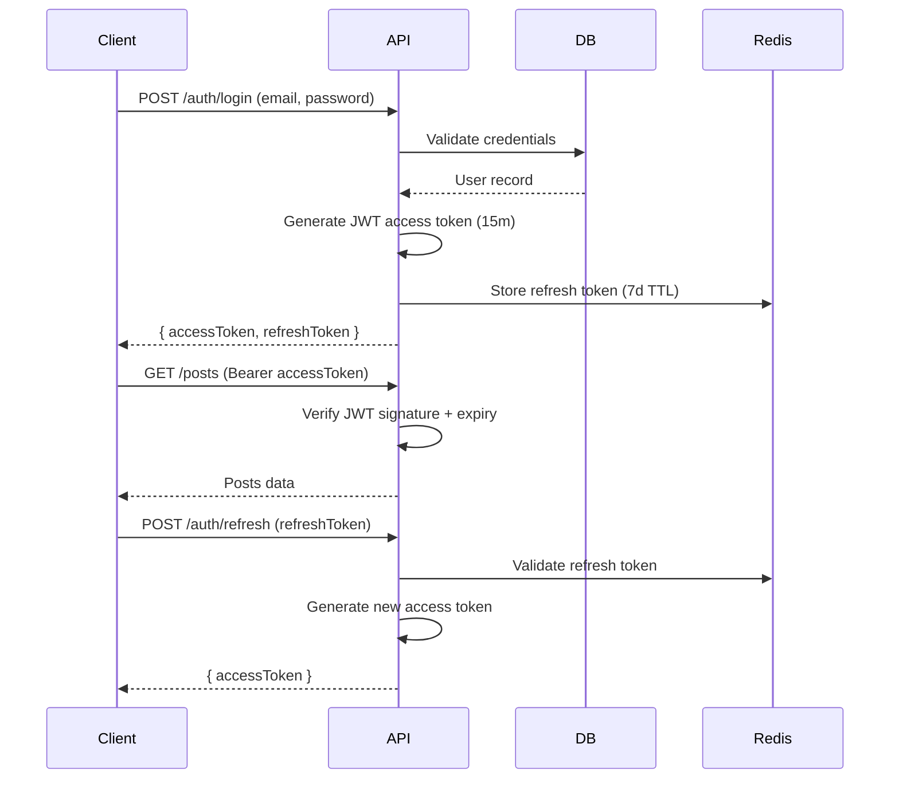
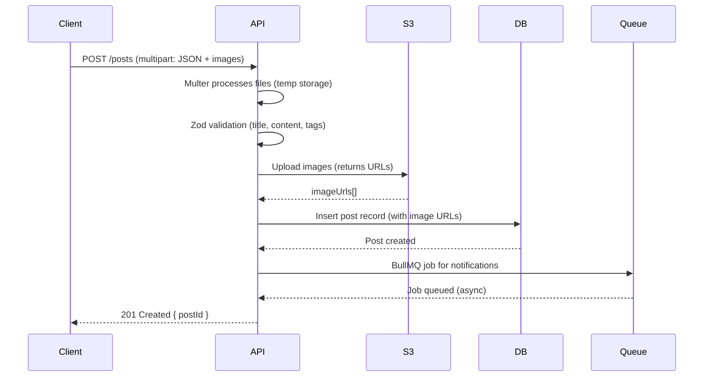

# WriteSpace Developer Guide

> Deep dive into architecture, decisions, and patterns for contributors and maintainers.

## 📋 Table of Contents
- [🧠 Architecture Philosophy](#-architecture-philosophy)
- [📁 Module Structure](#-module-structure)
- [🔄 Core Flows](#-core-flows)
- [🗄️ Database Design](#️-database-design)
- [🔐 Security Practices](#-security-practices)
- [🚦 Error Handling](#-error-handling)
- [📈 Performance Optimizations](#-performance-optimizations)
- [🧩 Adding a New Feature](#-adding-a-new-feature)
- [🧪 Testing Strategy](#-testing-strategy)
- [🐳 Local Development with Docker](#-local-development-with-docker)
- [🔧 Troubleshooting](#-troubleshooting)

## 🧠 Architecture Philosophy

WriteSpace follows **vertical slicing** with **dependency inversion**:

```text
src/
├── modules/ # Features (auth, posts, users...)
│ └── [feature]/
│ ├── controller.ts # HTTP layer (req/res handling)
│ ├── service.ts # Business logic
│ ├── routes.ts # Route registration
│ └── validation.ts # Zod schemas
├── shared/ # Cross-cutting concerns
└── db/ # Database layer (schemas + Drizzle)
```

**Rules:**
- Modules **do not import each other** directly — only through shared abstractions
- All infrastructure dependencies (DB, Redis, queues) are injected via constructors
- Shared utilities (`middlewares/`, `utils/`) are the only cross-module imports allowed  

## 📁 Module Structure 
Each module follows this pattern:  

```typescript
export class AuthController {
  constructor(private authService: AuthService) {}
  
  async register(req: Request, res: Response, next: NextFunction) {
    try {
      const result = await this.authService.register(req.body);
      return ApiResponse.success(res, result, 201);
    } catch (error) {
      next(error);  // Handled by global error middleware
    }
  }
}

// modules/auth/service.ts
export class AuthService {
  constructor(
    private userRepo: UserRepository,
    private redisClient: Redis,
    private mailer: MailerService
  ) {}
  
  async register(data: RegisterDto): Promise<AuthResult> {
    // Business logic here
  }
}

// modules/auth/routes.ts
const router = Router();
const controller = new AuthController(new AuthService(...));

router.post('/register', validate(registerSchema), controller.register);
router.post('/login', validate(loginSchema), controller.login);
``` 

## 🔄 Core Flows

### Authentication Flow


**Implementation details:**
-  Access token: JWT with `userId`, `role`, expires in 15m
-  Refresh token: UUID stored in Redis with `userId` mapping, 7d TTL
-  OAuth2: Passport.js strategies (`Google, GitHub`) with automatic user creation
-  Password reset: 6-digit code stored in Redis (15m expiry) sent via email

### Post Creation Flow


**Key files:**  

-  `shared/middlewares/upload.ts`: Multer configuration (limits: 5MB per file, 10 files max)
-  `modules/posts/service.ts`: createPost() method with S3 upload orchestration
-  `shared/queues/notificationWorker.ts`: BullMQ worker processing email notifications

### Notification Flow (Async)

```typescript
// shared/queues/notificationQueue.ts
export const notificationQueue = new Queue('notifications', {
  connection: redisConfig,
  defaultJobOptions: {
    attempts: 3,
    backoff: { type: 'exponential', delay: 5000 },
    removeOnComplete: true,
  }
});

// Worker processes
notificationQueue.process(async (job) => {
  const { type, recipientId, data } = job.data;
  
  switch(type) {
    case 'email':
      await mailer.send(recipientEmail, data.template, data.context);
      break;
    case 'in-app':
      await db.insert(notifications).values({ userId: recipientId, ...data });
      break;
  }
});
```

## 🗄️ Database Design

### Schema Overview

WriteSpace uses PostgreSQL managed via Drizzle ORM. The relational structure is designed for high performance, utilizing UUIDs for primary entities and composite primary keys for junction tables (like likes and follows) to ensure data integrity and fast lookups.

| Table | Purpose | Key Fields |
| :--- | :--- | :--- |
| `users` | User accounts, profiles, stats, and auth | `id` (uuid), `email`, `username`, `passwordHash`, `role`, `status` |
| `posts` | Blog posts (supports rich media/code) | `id` (uuid), `title`, `slug`, `content`, `authorId`, `status`, `publishDate` |
| `comments` | Threaded, hierarchical post comments | `id` (uuid), `content`, `postId`, `authorId`, `parentCommentId` |
| `likes` | Tracks user likes on posts | `userId`, `postId` (Composite PK) |
| `comment_likes` | Tracks user likes on specific comments | `commentId`, `userId` (Composite PK) |
| `shares` | Tracks post share events to platforms | `id` (serial), `userId`, `postId`, `platform` |
| `notifications` | In-app system and interaction alerts | `id` (serial), `recipientId`, `actorId`, `type`, `isRead` |
| `follows` | User-to-user follower relationships | `followerId`, `followingId` (Composite PK) |

### Key Design Decisions

1. **UUID primary keys**: Database-generated (`gen_random_uuid()`) for distributed system compatibility
2. **Soft deletes**: `deleted_at` timestamp on `posts`, `comments`, `users` (preserves data integrity)
3. **Polymorphic likes**: Single `likes` table with `target_type` enum ('post', 'comment')
4. **JSON content:** Post `content` stored as JSON for rich text structure (headings, images, code blocks)
5. **Indexes**: 
   ```sql
   CREATE INDEX idx_posts_author_status ON posts(author_id, status);
   CREATE INDEX idx_comments_post_parent ON comments(post_id, parent_id);
   CREATE INDEX idx_likes_target ON likes(target_id, target_type);
   ```
## Drizzle ORM Example
```typescript
// db/schema/posts.ts
export const posts = pgTable('posts', {
  id: uuid('id').primaryKey().defaultRandom(),
  title: varchar('title', { length: 255 }).notNull(),
  content: json('content').notNull(), // Rich text structure
  authorId: uuid('author_id').references(() => users.id).notNull(),
  status: pgEnum('post_status', ['draft', 'published', 'archived']).default('draft'),
  publishedAt: timestamp('published_at'),
  createdAt: timestamp('created_at').defaultNow(),
  deletedAt: timestamp('deleted_at'),
});

// db/schema/relations.ts
export const postsRelations = relations(posts, ({ one, many }) => ({
  author: one(users, { fields: [posts.authorId], references: [users.id] }),
  comments: many(comments),
  likes: many(likes),
}));
``` 

## 🔐 Security Practices

| Layer | Implementation |
| :--- | :--- |
| **Headers** | Helmet.js for security headers (XSS, CSP, HSTS) |
| **Rate Limiting** | `express-rate-limit`: 100 requests per 15 minutes per IP |
| **Input Validation** | Zod schemas with `.strict()` to reject unknown fields |
| **SQL Injection** | Drizzle ORM parameterized queries |
| **XSS** | Content sanitization before storing (DOMPurify on client) |
| **Password Storage** | bcrypt with 10 rounds |
| **JWT Storage** | Access token in memory, refresh token in Redis (not localStorage on client) |
| **CORS** | Whitelist configured via `CLIENT_URL` env var |


## 🚦 Error Handling

All errors use the `AppError` class:  
```typescript
// shared/utils/AppError.ts
export class AppError extends Error {
  public statusCode: number;
  public errorCode: string;
  
  constructor(message: string, statusCode = 500, errorCode = 'INTERNAL_ERROR') {
    super(message);
    this.statusCode = statusCode;
    this.errorCode = errorCode;
  }
}

// Usage
throw new AppError('Invalid credentials', 401, 'AUTH_001');
```

**Error Response Format:**  
```json
{
  "success": false,
  "error": {
    "code": "AUTH_001",
    "message": "Invalid credentials",
    "timestamp": "2026-03-30T10:30:00Z"
  }
}
```

**Global Error Handler** (`shared/middlewares/errorHandler.ts`):
-  Logs errors with Zario (structured logging)
-  Returns sanitized responses (no stack traces in production)
-  Handles Zod validation errors, JWT errors, and DB unique constraint violations

## 📈 Performance Optimizations

| Area | Strategy | Implementation |
| :--- | :--- | :--- |
| **Database** | Connection pooling | `pg.Pool` with min: 2, max: 10 |
| **Database** | Query optimization | Indexes on foreign keys, partial indexes for active records |
| **Database** | Pagination | Cursor-based for feeds (`WHERE id > lastId LIMIT 20`) |
| **Caching** | Post views | Redis cache with 5min TTL, write-through on view count |
| **Caching** | User sessions | Refresh tokens in Redis only |
| **Media** | Image uploads | Direct to S3 (not proxied through API) |
| **Media** | Image optimization (Future) | AWS Lambda for on-the-fly resizing |
| **Async Processing** | Notifications | BullMQ queue with separate worker process |
| **Async Processing** | Email sending | Batch processing (planned) |


## 🧩 Adding a New Feature  

### Step-by-Step Guide 

1. **Create module structure:**  
   ```bash
   mkdir -p src/modules/[feature]
   touch src/modules/[feature]/{controller,service,routes,validation,index}.ts
   ```

2. **Define Zod schemas** (`validation.ts`):
   ```typescript
   export const createFeatureSchema = z.object({
      name: z.string().min(3),
      description: z.string().optional(),
   });
   ```

3. **Implement service** (`service.ts`):
   ```typescript
   export class FeatureService {
   constructor(private db: DrizzleDB) {}
   
   async create(data: CreateFeatureDto) {
      return await this.db.insert(features).values(data).returning();
   }
   }
   ```

4. **Implement controller** (`controller.ts`):
   ```typescript
   export class FeatureController {
   constructor(private service: FeatureService) {}
   
   async create(req: Request, res: Response, next: NextFunction) {
      try {
         const result = await this.service.create(req.body);
         return ApiResponse.success(res, result, 201);
      } catch (error) { next(error); }
   }
   }
   ```

5. **Register routes** (`routes.ts`):

   ```typescript
   const router = Router();
   const controller = new FeatureController(new FeatureService(db));

   router.post('/', authenticate, validate(createFeatureSchema), controller.create);
   export default router;
   ```

6. **Mount in** `app.ts`:

   ```typescript
   import featureRoutes from './modules/feature/routes';
   app.use('/api/v1/features', featureRoutes);
   ```

7. **Add Drizzle schema** if new tables needed (`db/schema/feature.ts`)
8. **Write tests** (`test/modules/feature/feature.test.ts`)
9. **Update this documentation**

## 🧪 Testing Strategy

| Test Type | Tool | Location | Coverage Target |
| :--- | :--- | :--- | :--- |
| **Unit** | Jest + ts-jest | Alongside source (`*.test.ts`) | 80%+ |
| **Integration** | Jest + supertest | `test/integration/` | All API endpoints |

**Example Test:** 
```typescript
// modules/auth/auth.test.ts
describe('AuthController', () => {
  it('should register a new user', async () => {
    const response = await request(app)
      .post('/api/v1/auth/register')
      .send({ email: 'test@example.com', password: 'Test123!' });
    
    expect(response.status).toBe(201);
    expect(response.body.data.user).toHaveProperty('email', 'test@example.com');
  });
});
```

## 🐳 Local Development with Docker
```bash
# Start dependencies only (PostgreSQL + Redis)
docker-compose up -d postgres redis

# Run migrations
bun run db:migrate

# Start dev server (hot reload)
bun run dev
```

**docker-compose.yml:**
```yaml
services:
  postgres:
    image: postgres:16
    environment:
      POSTGRES_DB: writespace
      POSTGRES_USER: postgres
      POSTGRES_PASSWORD: postgres
    ports:
      - "5432:5432"
    volumes:
      - pgdata:/var/lib/postgresql/data
  
  redis:
    image: redis:7.2-alpine
    ports:
      - "6379:6379"
```

## 🔧 Troubleshooting

| Issue | Likely Cause | Solution |
| :--- | :--- | :--- |
| `Error: connect ECONNREFUSED 127.0.0.1:5432` | PostgreSQL not running | Run `docker-compose up -d postgres` |
| `Error: Redis connection failed` | Redis not running | Run `docker-compose up -d redis` |
| `Drizzle migration error: relation already exists` | Migration state mismatch | Run `bun run db:drop` (dev only) → `bun run db:generate` → `bun run db:migrate` |
| `JWT_SECRET must be provided` | Missing env variable | Add `JWT_ACCESS_SECRET` and `JWT_REFRESH_SECRET` to `.env` |
| `MulterError: Unexpected field` | Form field name mismatch | Check `upload.single('image')` matches client field name |
| `S3 upload fails: AccessDenied` | AWS credentials/permissions | Verify IAM role has `s3:PutObject` permission |
| `Test suite hanging` | Test DB not reset | Ensure `NODE_ENV=test` uses a separate database |  

**Need help?** Open an issue or contact [@Afzal14786](https://github.com/afzal14786) on **GitHub**.